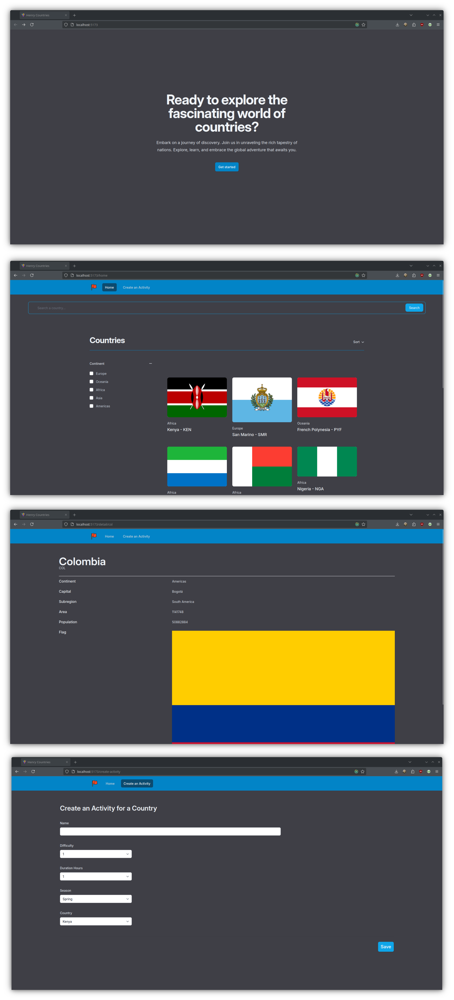

# Henry Countries App

## Resumen

Henry Flags es una aplicación web desarrollada como parte de un proyecto individual durante un bootcamp para convertirse en un desarrollador capacitado. El objetivo principal de esta aplicación es conectarse a una API que proporciona información sobre varios países y sus banderas, mostrándolas en tarjetas fáciles de usar. Además, los usuarios tienen la capacidad de crear nuevos perfiles de países, que luego se almacenan en la base de datos de la aplicación.

## Características

- **Información de Países:** Utiliza una API de terceros para obtener información detallada sobre diferentes países y sus banderas.
- **Mostrar Tarjetas:** Presenta los datos obtenidos en tarjetas visualmente atractivas para facilitar su consumo.
- **Crear Nuevos Países:** Los usuarios pueden crear y agregar nuevos países, con la información almacenada en la base de datos de la aplicación.

## Tecnologías Utilizadas

- **React:**
- **React DOM:**
- **React Router DOM:**
- **Redux:**
- **React Redux:**
- **Tailwind CSS:**

## Capturas de Pantalla

